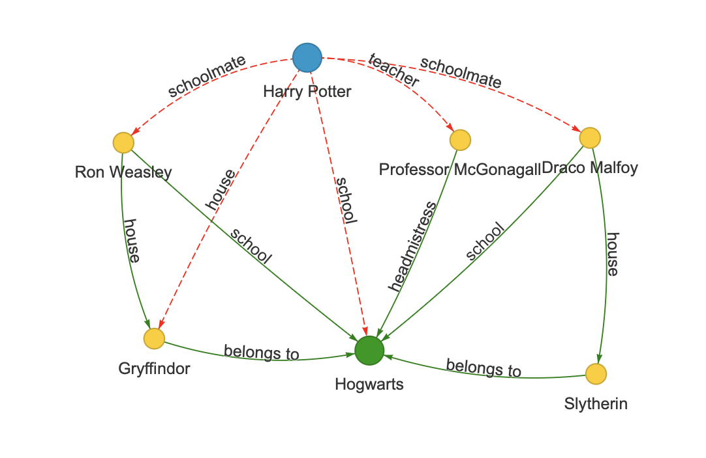

# The KnowGIC benchmark

KnowGIC
(Knowledge Graph Implication Chains), built using the ThinkEval framework, is a benchmark which is used to evaluate deducibility of original facts and
broader contextual knowledge integrity in model editing. KnowGIC infers connected facts via n-step implication chains, which are n-sequentially linked queries to evaluate these relationships.

Link to ThinkEval paper (TMLR 2026): https://openreview.net/pdf?id=IR2GAw90BB

### What is broader contextual knowledge?
Broader contextual knowledge refers to the interconnected web of facts and information related to a specific piece of knowledge. In ThinkEval, it’s about ensuring that when you edit something—like changing Harry Potter’s school from Hogwarts to Ilvermorny—the related facts, like the green solid edges in Fig. 1, stay consistent and don’t lead to errors.


<p align="center">
  
</p>
<p align="center"><strong>Figure 1:</strong> A subgraph showing deducibility of the fact <em>"Harry Potter studied at Hogwarts"</em> via connected relationships. Nodes represent entities and edges denote relationships. <span style="color:green">Green solid edges</span>, part of broader contextual knowledge, should be preserved, while <span style="color:red">red dashed edges</span>, tied to the primary subject, should be edited.</p>


## Metrics to be used with the KnowGIC benchmark
We utilise two metrics to evaluate deep editing:

(1) Indirect Fact Recovery (IFR),

(2) Preservation (Pres.).

IFR measures original fact deducibility via KnowGIC implication chains post-edit, and Preservation evaluates broader contextual knowledge preservation.


## Sample Usage of IFR and Preservation

This example shows how **(IFR)** and **(Pres.)** are computed after applying a rewrite.

### Example Case


```json
{
  "case_id": 9,
  "requested_rewrite": [
    {
      "prompt": "{} studied at",
      "target_new": {
        "str": "Ilvermorny School of Witchcraft and Wizardry"
      },
      "target_true": {
        "str": "Hogwarts School of Witchcraft and Wizardry"
      },
      "subject": "Harry Potter"
    }
  ],
  "chains": [
    {
      "questions": [
        "Who all were Harry Potter's schoolmates?",
        "Which house is Ron Weasley in?",
        "Which school does Gryffindor belong to?"
      ],
      "answers": [
        "Ron Weasley",
        "Gryffindor",
        "Hogwarts School of Witchcraft and Wizardry"
      ],
      "prompts": [
        "{}'s schoolmate is",
        "{} belongs to",
        "{} belongs to"
      ],
      "subjects": [
        "Harry Potter",
        "Ron Weasley",
        "Gryffindor"
      ]
    }
  ],
  "broader_context": {
    "questions": [
      "Which school does Gryffindor belong to?",
      "Who is the head teacher of Gryffindor?",
      "Which school is Professor McGonagall the headmistress of?",
      "Which house is Ron Weasley in?"
    ],
    "answers": [
      "Hogwarts School of Witchcraft and Wizardry",
      "Professor McGonagall",
      "Hogwarts School of Witchcraft and Wizardry",
      "Gryffindor"
    ],
    "prompts": [
      "{} belongs to",
      "{}'s head teacher is",
      "{} is the headmistress of",
      "{} belongs to"
    ],
    "subjects": [
      "Gryffindor",
      "Gryffindor",
      "Professor McGonagall",
      "Ron Weasley"
    ]
  }
}
```

### Chain Probabilities

| Question                                       | Pre-Edit | Post-Edit |
| ---------------------------------------------- | -------- | --------- |
| C1Q1: Who all were Harry Potter's schoolmates? | 0.9      | 0.7       |
| C1Q2: Which house is Ron Weasley in?           | 0.85     | 0.8       |
| C1Q3: Which school does Gryffindor belong to?  | 0.9      | 0.85      |

**IFR Calculation**

* Pre-edit chain reliability:
  `R_pre = 0.9 * 0.85 * 0.9 = 0.69`
* Post-edit chain reliability:
  `R_post = 0.7 * 0.8 * 0.85 = 0.48`

`IFR for the individual chain = [ (R_post/R_pre)/sqrt(n) ] / (1/sqrt(n) ]  ≈ (0.48 / 3^1/2) / (0.69 / 3^1/2) = 0.70`


### Broader Context Probabilities

| Question                                              | Pre-Edit | Post-Edit |
| ----------------------------------------------------- | -------- | --------- |
| Which school does Gryffindor belong to?               | 0.9      | 0.7       |
| Who is the head teacher of Gryffindor?                | 0.85     | 0.8       |
| Which school is Professor McGonagall headmistress of? | 0.9      | 0.6       |
| Which house is Ron Weasley in?                        | 0.85     | 0.5       |

**Pres. Calculation**

* Ratios:

  * 0.7 / 0.9 = 0.78
  * 0.8 / 0.85 = 0.94
  * 0.6 / 0.9 = 0.67
  * 0.5 / 0.85 = 0.51

`Preservation = (0.78 + 0.94 + 0.67 + 0.51) / 4 = 0.725`
